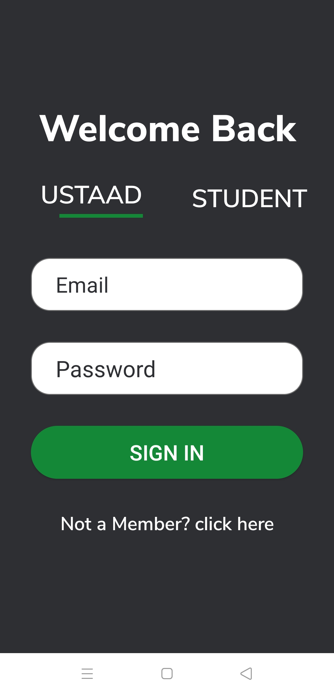

# Tutor mobile application.

A social media marketplace for tutor and students.

### Features:
- Authentication
- Role base authorization
- Real time chat
- Ad posting
- etc

### Languages
- Android Studio Java (Frontend)
- Ruby on Rails (Backend)

